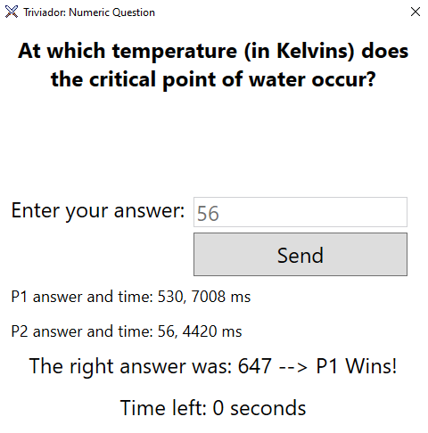

## Triviador
For basic information about the game read the main README.md.

### User documentation
#### Client
   
Client app requires no setup. Just run the executable and the main window will appear.

Main window contains two text fields where the IP address and port for the server are specified. The user may recieve some message in the textbox on the right side.


After connecting to the server, the main game window appears. It contains a map of the Czech Republic with 14 clickable regions. It also contains information about players' health points and regular points.

There is a textbox on the bottom containing current game status, updated on a regular basis.

Each of the players has an unique identifier shown on the board as well. Currently, the game supports 2 players, one with the red color and one with the blue color.

The colors have the following meaning:
- darker color shade represents the base regions
- green color represents the region which is currently being under attack
- yellow color represents currently picked region
- striped pattern represents high valued regions


Currently, the game contains two types of questions, numeric questions and questions with 4 possible options.
When the clients receive a question from the server, a question window pop-up is shown.

The window for questions with choices contains just 4 buttons. After the time expires, enemy's answer is shown as well and the correct answer is marked by a green border around the responsible button.

<div style="margin-left: auto; margin-right: auto; width: 50%;">

</div>

The window for numeric questions contains a text field, where the user may enter an answer. When the field contains invalid characters, 0 is sent to the server as an answer.

After the time expires, both players' answers and answer times are sent back to the clients. A winner is announced and the game continues in the game window.

<div style="margin-left: auto; margin-right: auto; width: 50%;">

</div>

#### Server
   
The server currently requires multiple files to run. Before running, the administrator must prepare the following files inside the directory with the executable:

`questionsABCD.txt` - contains questions with the possible answers, first one being the correct

`questionsNumber.txt` - contains numeric questions with the correct answer

`config.cfg` - here the administrator specifies the used IP address and port

The administrator may use the defaults, but it is certainly possible to add new questions or modify the existing ones.

After this the server may be run. The usage is very simple - just run the executable. The server will do everything automatically.

The server communicates with both clients via simple messages in the JSON format.
Log message example below:

```json
00000726{
  "type": "gameUpdate",
  "playerid": null,
  "region": null,
  "gameinformation": {
    "Points": [
      2600,
      2000
    ],
    "Regions": [
      [
        4,
        12,
        9,
        0,
        3,
        2,
        5,
        1
      ],
      [
        7,
        11,
        10,
        6,
        8,
        13
      ]
    ],
    "BaseHealths": [
      3,
      3
    ],
    "Bases": [
      4,
      7
    ],
    "HighValueRegions": [
      1
    ]
  },
  "questionabcd": null,
  "questionnumeric": null,
  "answerdetails": {
    "correct": null,
    "times": [
      null,
      null
    ],
    "answers": [
      null,
      null
    ]
  }
}
```

### Programmer documentation
All used methods are documented in the code.

The application consists of three projects.
The basic idea is that there is a server running, two (or potentially more) clients connect to the server and play the game. 

1. Commons

This project includes all common classes and method used by the class and the server.
File `Constants.cs` contains all of the messages exchanged between the server/client and delays, round times and other constants as well.
It also contains information about the regions and their neigbors.
File `GameInformation.cs` contains definition of the game data which is exchanged between the server and clients.
File `JsonFormats.cs` contains JSON format definition for messages exchanged between the server and clients.
File `MessageController.cs` contains logic used for receiving messages and converting game data to JSON.

2. Server
   
Server is composed as a console application. The server is controlled with the `Program.cs` file in its specific directory. The main file tries to create the server and run it properly. The server listens on a specified port and IP address read from the config file.
File `Server.cs` handles all of the server logic. It controls all of the rounds by sending messages to all clients accordingly, by calling the `FirstRound` and `SecondRound` methods by the defined rules. When the game ends, the server restarts and new players may connect. If any of the clients disconnects, the sever will reset as well.

3. Client

The client app is a WPF app for Windows platform. The client connects to a server with an IP and a port, which later communicates with the client and sends all of the needed information. The client application consists of four windows - one is the main window with connection information, the second one being the game window and two question windows. All of the windows respond accordingly to the server's instructions.

In the client files, it is pretty usual to find a line like this one:
```cs
App.Current.Dispatcher.Invoke((Action)delegate { //code
});
```
This means that the code inside had to be executed from the main thread (to update the window).

### Short files description
`client/GameWindow.xaml(.cs)` - game board, controls main game logic

`client/MainWindow.xaml(.cs)` - initial login window, controls client-server connection

`client/QuestionABCDWindow.xaml(.cs)` - shows a window with some question with 4 possible answers

`client/QuestionNumericWindow.xaml(.cs)` - shows a window with a numeric question

`common/Constants.cs` - contains all common data

`common/GameInformation.cs` - contains definitons for all common game information

`common/JsonFormats.cs` - contains JSON format definition

`common/MessageController.cs` - contains logic used for receiving messages and encoding game data to JSON

`server/Program.cs` - provides an entrypoint for the server

`server/Server.cs` - contains all of the server logic

### Possible extensions
The program could be extended in many ways. Some of those contain: 

- making the game faster - do not wait for time left etc.
- replacing the questions' file for a whole database
- map choosing
- 3-players game
- AI for singleplayer games
- different rules for a fast/long game
- player chat
- question hints, points system
- login system with a player database

### Review
The hardest part about creating the game was to actually think of the communication between clients and server. 
Firstly, the idea was to use more async methods, but as the game got more complicated, it would have been too hard to manage the timings.
Because the client's main thread (including windows) freezes entirely when using `Thread.Sleep()`, it was necessary to run the game logic in a different thread.
As there are many possible extensions to the program, there is a strong chance that I will continue developing the app further more, but right now I am pretty much satisfied with the results.